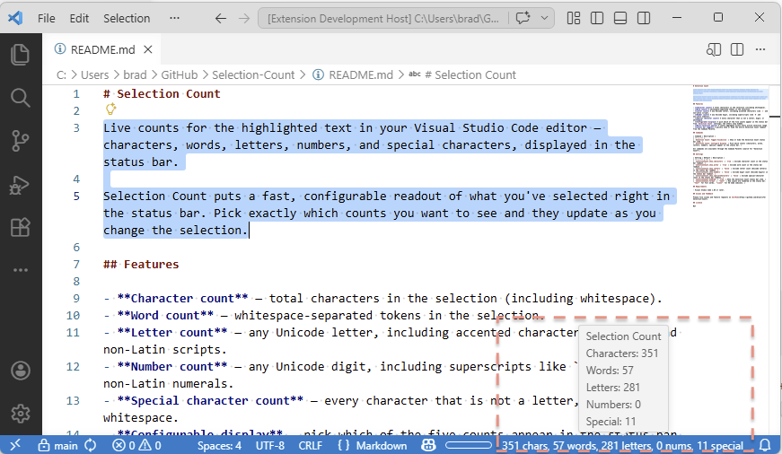
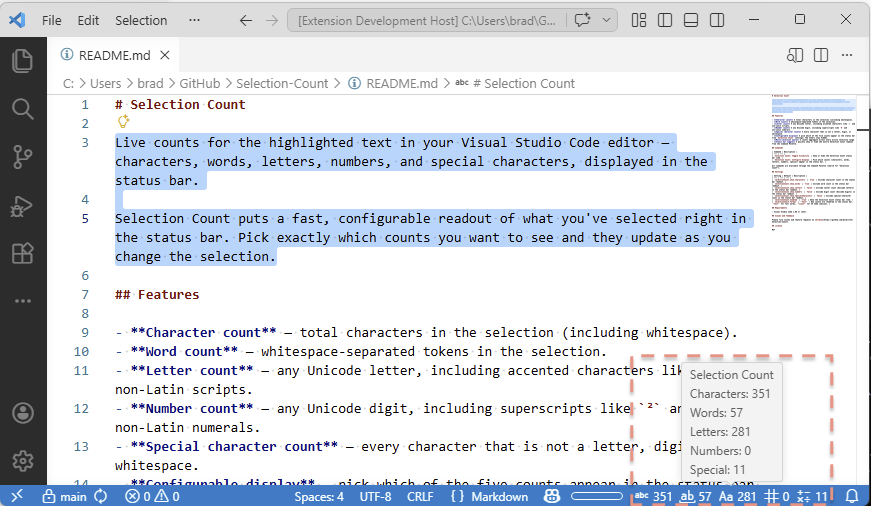
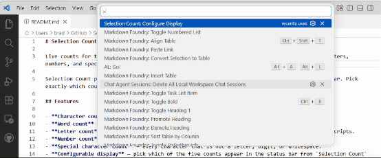
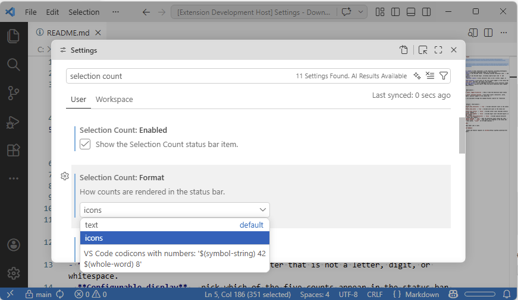

# Selection Count

Live counts for the highlighted text in your Visual Studio Code editor — characters, words, letters, numbers, and special characters, displayed in the status bar.

Selection Count puts a fast, configurable readout of what you've selected right in the status bar. Pick exactly which counts you want to see and they update as you change the selection.

## Demo









## Features

- **Character count** — total characters in the selection (including whitespace).
- **Word count** — whitespace-separated tokens in the selection.
- **Letter count** — any Unicode letter, including accented characters like `é` and non-Latin scripts.
- **Number count** — any Unicode number, including superscripts like `²`, fractions like `½`, and non-Latin numerals.
- **Special character count** — every character that is not a letter, number, or whitespace.
- **Configurable display** — pick which of the five counts appear in the status bar from `Selection Count` settings; the others stay hidden.
- **Multi-selection aware** — counts aggregate across every active selection range.
- **Status bar toggle** — quickly show or hide the entire Selection Count readout from the Command Palette.

## Commands

| Command | Description |
| --- | --- |
| `Selection Count: Toggle Visibility` | Show or hide the Selection Count status bar item. |
| `Selection Count: Configure Display` | Pick which counts (characters, words, letters, numbers, special) appear in the status bar. |

All commands are available through the Command Palette (search for "Selection Count").

## Keybindings

Selection Count ships **no default keybindings**. Both commands apply globally rather than in a specific editor context, so any default shortcut would risk colliding with a VS Code built-in or another extension.

To bind them yourself, open the Command Palette → **Preferences: Open Keyboard Shortcuts (JSON)** and add an entry for each command ID:

```json
[
  { "key": "ctrl+k ctrl+v", "command": "selectionCount.toggleVisibility" },
  { "key": "ctrl+k ctrl+d", "command": "selectionCount.configureDisplay" }
]
```

Swap in whatever combination is free on your keymap — VS Code's Keyboard Shortcuts editor flags conflicts as you type.

## Settings

| Setting | Default | Description |
| --- | --- | --- |
| `selectionCount.show.characters` | `true` | Include character count in the status bar readout. |
| `selectionCount.show.words` | `true` | Include word count in the status bar readout. |
| `selectionCount.show.letters` | `false` | Include letter count (Unicode letters) in the status bar readout. |
| `selectionCount.show.numbers` | `false` | Include number count (Unicode numbers — digits, fractions, superscripts, etc.) in the status bar readout. |
| `selectionCount.show.specialCharacters` | `false` | Include special-character count (everything that is not a letter, number, or whitespace) in the status bar readout. |
| `selectionCount.enabled` | `true` | Show the Selection Count status bar item. |
| `selectionCount.format` | `"text"` | How counts are rendered in the status bar. `"text"` for full words, `"icons"` for VS Code codicons. |

## Requirements

- Visual Studio Code 1.85 or later.

## Issues and feedback

Please file issues and feature requests on [GitHub](https://github.com/dvlprlife/Selection-Count).

## Contributing

Contributions are welcome — see [CONTRIBUTING.md](CONTRIBUTING.md) for setup, the build/test commands, and the issue-first workflow.

## License

MIT
